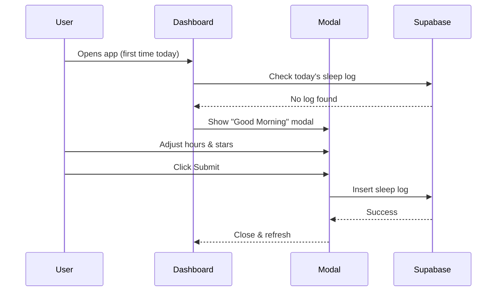

# Daily Sync Modal Implementation

## Overview
A simple, friendly sleep tracking modal that automatically appears when users open the app for the first time each day. No external APIs, no complexity—just two quick inputs that take 10 seconds.

## Design Philosophy
**Simple. Reliable. No external APIs.**

When the user opens the app for the first time in a day:
```
Good Morning Rutuja ☀️
How was your sleep?
[ 6.5 hours ]
[ ★★★★☆ ]
[ Submit ]
```

## Component

### **DailySyncModal.jsx**
Location: `src/components/DailySyncModal.jsx`

**Features:**
- ☀️ Personalized greeting with user's first name
- 🌙 Sleep hours slider (0-12 hours, 0.5 step increments)
- ⭐ Sleep quality rating (1-5 stars with smooth animations)
- ✨ Clean, friendly design
- 🎨 Dark mode support
- 🚫 No external API dependencies
- ⚡ Saves directly to Supabase

**Props:**
- `isOpen` (boolean) - Controls modal visibility
- `onClose` (function) - Callback when modal is closed
- `onSuccess` (function) - Callback after successful submission
Location: `src/components/cid/CognitiveIntelligenceDashboard.jsx`

**Logic:**
1. On component mount, checks if user has submitted a sleep log for today
2. Queries `sleep_logs` table filtering by `student_id` and `log_date`
3. If no log exists, automatically shows the Daily Sync Modal
4. User can dismiss or submit the modal

## Integration

Location: `src/components/cid/CognitiveIntelligenceDashboard.jsx`

**Auto-Trigger Logic:**
1. On component mount, checks if user has submitted a sleep log for today
2. Queries `sleep_logs` table filtering by `student_id` and `log_date`
3. If no log exists, automatically shows the modal
4. User can submit their sleep data in ~10 seconds

## Database Schema

### `sleep_logs` Table
```sql
CREATE TABLE sleep_logs (
  id UUID PRIMARY KEY DEFAULT uuid_generate_v4(),
  student_id UUID REFERENCES auth.users(id) ON DELETE CASCADE,
  sleep_hours DECIMAL(3,1) NOT NULL,
  sleep_quality INTEGER CHECK (sleep_quality >= 1 AND sleep_quality <= 5),
  log_date DATE NOT NULL,
  created_at TIMESTAMP WITH TIME ZONE DEFAULT NOW(),
  UNIQUE(student_id, log_date)
);
```

## Workflow



## Data Payload

### Sleep Log Insert
```javascript
{
  student_id: "uuid",
  sleep_hours: 6.5,
  sleep_quality: 4,
  log_date: "2026-02-21"
}
```

## Usage Example

```jsx
import { DailySyncModal } from '../components/DailySyncModal';

function MyComponent() {
  const [showModal, setShowModal] = useState(false);

  return (
    <DailySyncModal
      isOpen={showModal}
      onClose={() => setShowModal(false)}
      onSuccess={(data) => {
        console.log('Sleep logged:', data);
        // Modal automatically closes after success
      }}
    />
  );
}
```

## Features

✅ **Auto-trigger on first daily visit** - Only shows if no log exists for today  
✅ **Personalized greeting** - Uses user's first name from profile  
✅ **Beautiful, simple UI** - Clean design, smooth animations  
✅ **10-second experience** - Quick slider + stars, one click to submit  
✅ **Dark mode support** - Seamless theme switching  
✅ **No external dependencies** - Only Supabase, no webhooks or APIs  
✅ **Reliable** - Saves directly to database with error handling  

## Testing

1. Navigate to the Cognitive Intelligence Dashboard
2. Modal should appear with "Good Morning [Your Name]"
3. Adjust sleep hours with the slider
4. Click stars to set quality (1-5)
5. Click Submit
6. Check Supabase `sleep_logs` table for the new entry
7. Modal won't appear again until tomorrow

## Notes

- Modal appears **once per day** per user (first visit)
- Duplicate logs prevented by database constraint
- No external API calls - simple and reliable
- Real-time data updates via Supabase subscriptions
- Takes ~10 seconds to complete
